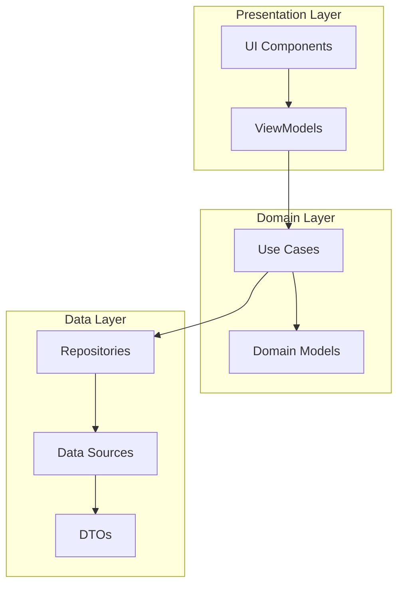
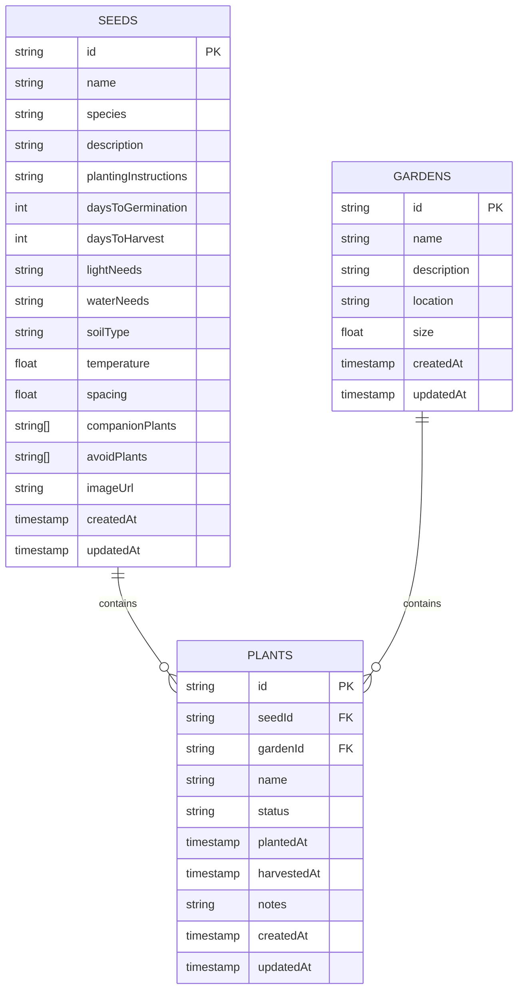
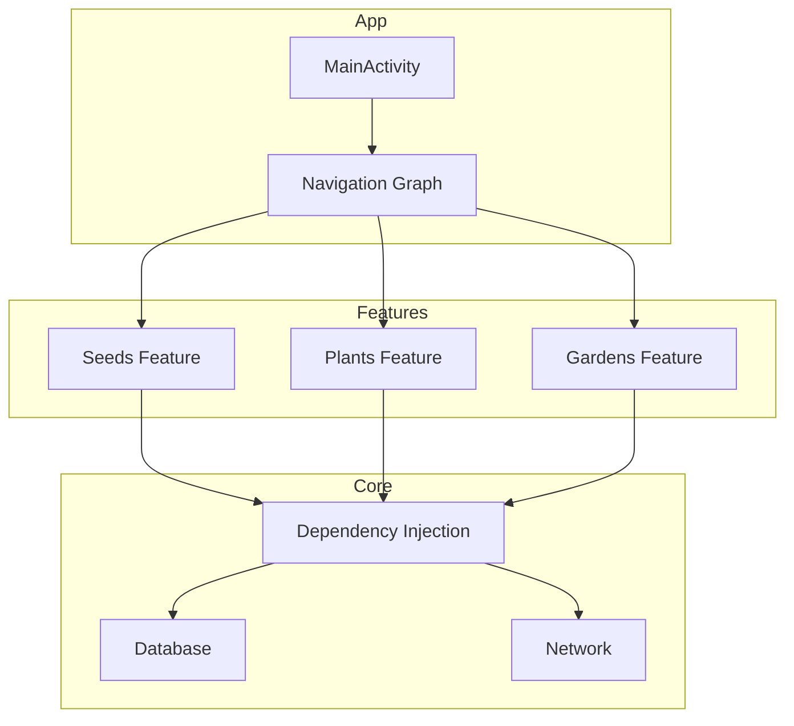
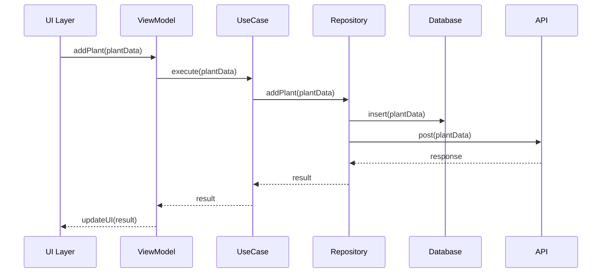
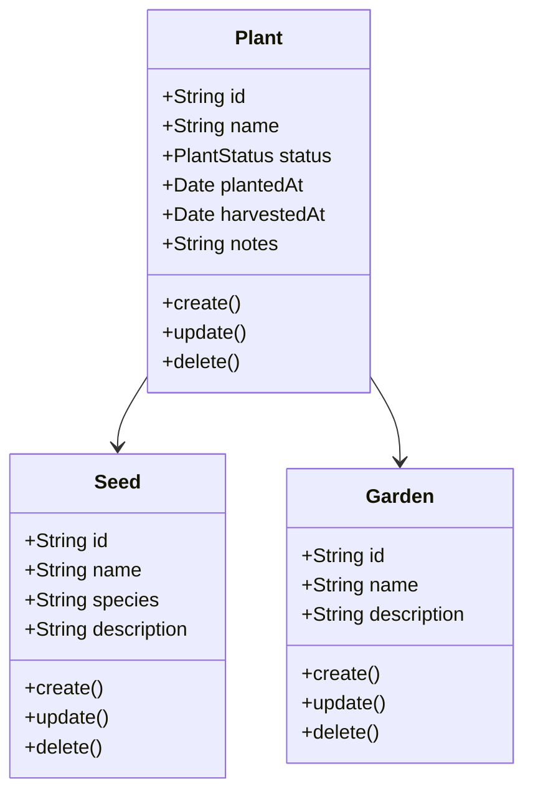
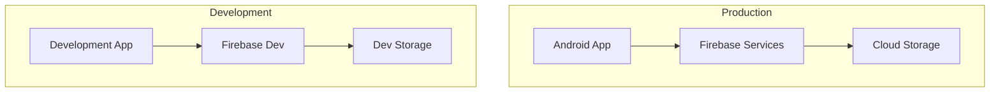
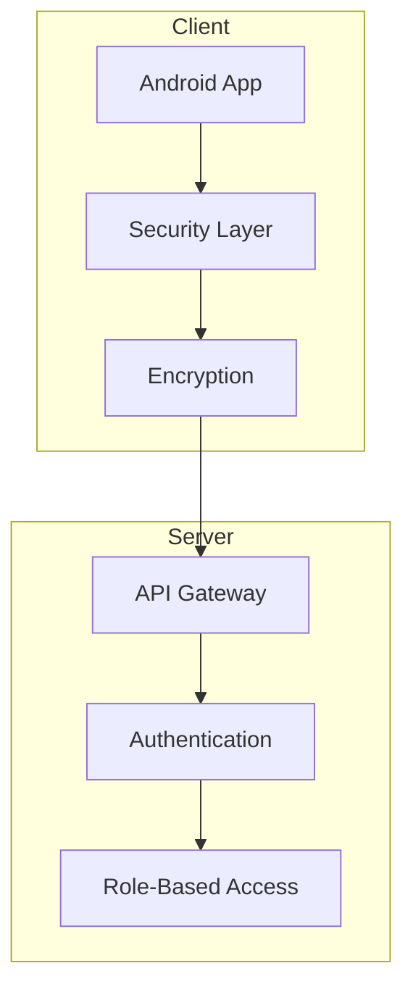
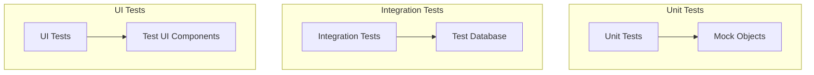

# Arkitekturdiagram

## Översikt
Detta dokument innehåller arkitekturdiagram för PlantSeeds3-projektet.

## Clean Architecture

## Databasstruktur

## Komponentdiagram

## Sekvensdiagram

### Lägga till en ny planta

## Klassdiagram

## Deployment-arkitektur

## Säkerhetsarkitektur

## Testarkitektur

