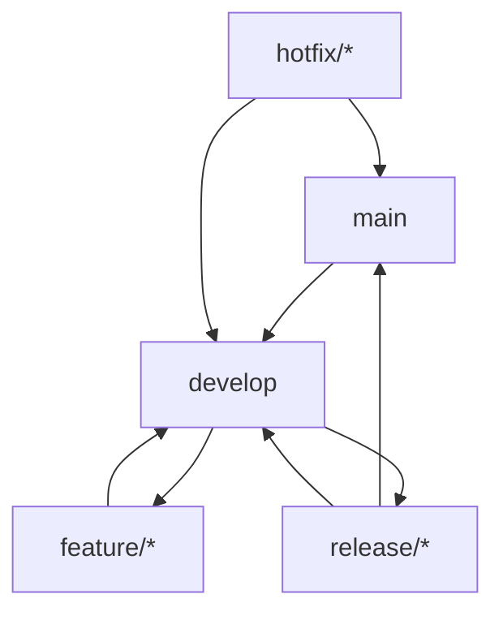

# Git-arbetsflöde

## Översikt
PlantSeeds3 följer ett strukturerat Git-arbetsflöde för att säkerställa effektiv versionshantering och samarbete mellan utvecklare.

## Branch-strategi

### 1. Huvudbrancher
```bash
main           # Produktionsversion
develop        # Utvecklingsversion
release/*      # Release-brancher
feature/*      # Feature-brancher
hotfix/*       # Hotfix-brancher
```

### 2. Branch-flöde


## Commit-konventioner

### 1. Commit-meddelanden
```
<type>(<scope>): <description>

[optional body]

[optional footer]
```

### 2. Commit-typer
```bash
feat:     Ny funktionalitet
fix:      Bugfix
docs:     Dokumentationsändringar
style:    Formateringsändringar
refactor: Kodrefaktorering
test:     Testning
chore:    Underhåll
```

### 3. Exempel
```bash
feat(plants): lägg till stöd för plantstatus
fix(auth): korrigera inloggningsfel
docs(readme): uppdatera installationsinstruktioner
```

## Feature-utveckling

### 1. Skapa feature-branch
```bash
# Uppdatera develop
git checkout develop
git pull origin develop

# Skapa och byt till feature-branch
git checkout -b feature/plant-status
```

### 2. Utveckla feature
```bash
# Commita ändringar
git add .
git commit -m "feat(plants): implementera plantstatus"

# Pusha till remote
git push origin feature/plant-status
```

### 3. Merga feature
```bash
# Uppdatera develop
git checkout develop
git pull origin develop

# Merga feature
git merge feature/plant-status --no-ff

# Pusha till remote
git push origin develop
```

## Release-process

### 1. Skapa release-branch
```bash
# Uppdatera develop
git checkout develop
git pull origin develop

# Skapa release-branch
git checkout -b release/v1.0.0
```

### 2. Förbered release
```bash
# Uppdatera versionsnummer
./gradlew updateVersion -Pversion=1.0.0

# Commita ändringar
git add .
git commit -m "chore(release): förbered version 1.0.0"
```

### 3. Slutför release
```bash
# Merga till main
git checkout main
git merge release/v1.0.0 --no-ff
git tag -a v1.0.0 -m "Release version 1.0.0"

# Merga till develop
git checkout develop
git merge release/v1.0.0 --no-ff

# Ta bort release-branch
git branch -d release/v1.0.0
```

## Hotfix-process

### 1. Skapa hotfix-branch
```bash
# Skapa från main
git checkout main
git pull origin main
git checkout -b hotfix/critical-bug
```

### 2. Fixa buggen
```bash
# Gör ändringar och commita
git add .
git commit -m "fix(auth): åtgärda säkerhetsproblem"

# Pusha till remote
git push origin hotfix/critical-bug
```

### 3. Slutför hotfix
```bash
# Merga till main
git checkout main
git merge hotfix/critical-bug --no-ff
git tag -a v1.0.1 -m "Hotfix version 1.0.1"

# Merga till develop
git checkout develop
git merge hotfix/critical-bug --no-ff

# Ta bort hotfix-branch
git branch -d hotfix/critical-bug
```

## Code Review

### 1. Pull Request
```markdown
## Beskrivning
Implementerar stöd för plantstatus i applikationen.

## Ändringar
- Lägger till PlantStatus enum
- Uppdaterar Plant-modellen
- Implementerar statusuppdateringar

## Testning
- [x] Enhetstester
- [x] UI-tester
- [x] Integrationstester

## Checklista
- [x] Följer kodningsstandarder
- [x] Inkluderar dokumentation
- [x] Har testning
- [x] Uppdaterar versionsnummer
```

### 2. Review-process
1. Skapa pull request mot develop
2. Vänta på minst en godkännande review
3. Åtgärda eventuella kommentarer
4. Merga efter godkännande

## Versionshantering

### 1. Semantic Versioning
```
MAJOR.MINOR.PATCH

1.0.0  # Första release
1.1.0  # Ny funktionalitet
1.1.1  # Bugfix
```

### 2. Tagging
```bash
# Skapa tag
git tag -a v1.0.0 -m "Release version 1.0.0"

# Pusha tag
git push origin v1.0.0
```

## Best Practices

### 1. Branch-hantering
- Håll brancher uppdaterade
- Använd beskrivande branch-namn
- Ta bort oanvända brancher
- Följ branch-strategin

### 2. Commit-hantering
- Commita ofta och i logiska delar
- Använd beskrivande commit-meddelanden
- Följ commit-konventioner
- Reviewa ändringar innan commit

### 3. Code Review
- Granska kod noggrant
- Ge konstruktiv feedback
- Följ checklistor
- Godkänn endast kvalitetskod

### 4. Versionshantering
- Följ semantic versioning
- Tagga alla releases
- Dokumentera ändringar
- Hantera beroenden

### 5. Samarbete
- Kommunera med teamet
- Uppdatera dokumentation
- Dela kunskap
- Följ teamkonventioner 